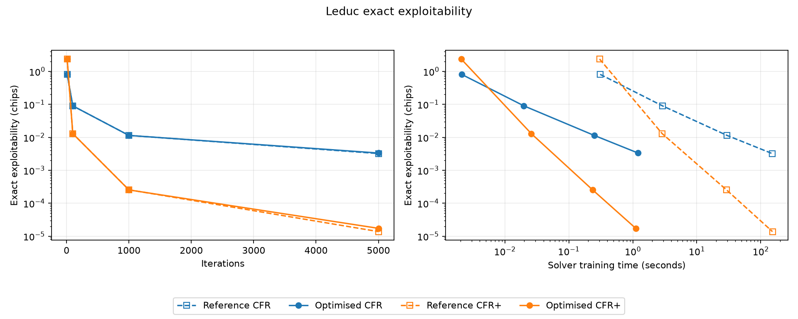
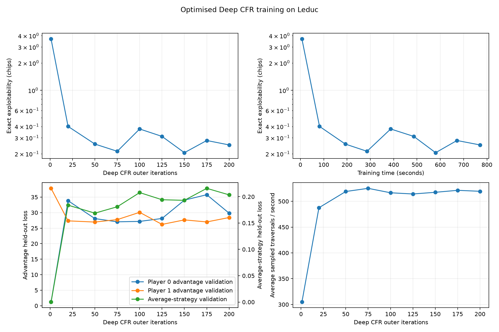
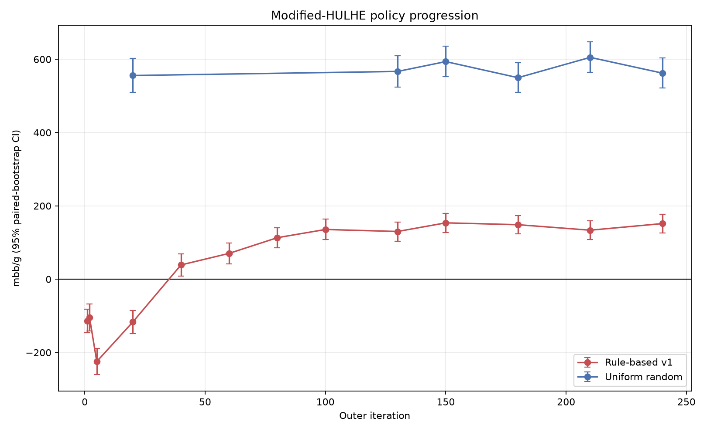

# AC CFR

A game-theoretic poker solver platform written in Python, with optimised implementations of CFR (counterfactual regret minimisation), CFR+, external-sampling MCCFR and Deep CFR. Solver policies were trained entirely through self-play on custom engines for Kuhn, Leduc and heads-up limit Hold'em.

The project also includes a deployed web application for playing hands against the trained solver policies.

[Play the deployed web demo](https://ac-cfr-web-65ltbjsegq-nw.a.run.app/)

## Technologies

- **Solvers and evaluation:** Python, PyTorch, NumPy, Numba and Matplotlib
- **Web:** FastAPI, HTML, CSS and JavaScript
- **Testing and deployment:** pytest, GitHub Actions, Docker and Google Cloud Run

## Key components

- Self-play training pipelines for CFR and CFR+ on Kuhn and Leduc, external-sampling MCCFR on Leduc, and Deep CFR on Leduc and a modified version of heads-up limit Hold'em.
- Custom Kuhn, Leduc and heads-up limit Hold'em engines, with indexed Kuhn and Leduc trees, compact on-demand Hold'em states, suit-isomorphic information states and a perfect-hash seven-card hand evaluator.
- Exact best-response evaluation for Kuhn and Leduc, with duplicate-deal matches against fixed opponents and earlier snapshots for modified HULHE.
- Optimised solver implementations achieve speedups of `27.3x` to `138.3x` for CFR, CFR+ and MCCFR and `6.55x` for Leduc Deep CFR compared with recursive baselines in controlled benchmarks.
- Reproducible training with resumable checkpoints and scheduled policy snapshots for evaluation and play.
- A containerised FastAPI and JavaScript web application deployed on Google Cloud Run for playing against the trained policies.

## How it works

### Games and information states

The game engines hold the complete state of a hand, but solvers and playable agents receive only an information state: the acting player's cards, public cards and betting history. Opponent private cards never enter a policy decision. After training, each saved policy can be loaded through a common interface for exact evaluation, head-to-head matches and web play.

Kuhn and Leduc are small enough to compile into dense trees with stable integer indices for nodes, information sets, actions and children. Hold'em is not, so its configurable engine creates compact states on demand. Suit-isomorphic Hold'em states share a deterministic encoding, reducing duplicate strategic representations without changing physical deal probabilities.

At showdown, a direct perfect-hash evaluator maps seven cards to a `1..7462` hand rank, where 1 is strongest. Its committed lookup tables are generated deterministically and tested against both an evaluator that checks all 21 five-card combinations and the independent `phevaluator` library. The engine supports conventional heads-up limit Hold'em and the reduced game used for Deep CFR training.

### CFR, CFR+ and MCCFR

For each information set `I` and legal action `a`, CFR updates a cumulative regret score:

```text
regret(I, a) += counterfactual reach × (action value(I, a) - strategy value(I))
```

The action value is the expected result from choosing `a` at `I` and following the current strategy afterwards. The strategy value is the expected result under the current mix of actions at `I`. Counterfactual reach is the probability that card deals and the opponent's decisions lead to the information set, excluding the updating player's own earlier action probabilities. Regret matching normalises positive cumulative regrets into the next strategy, while accumulated strategies weighted by the player's reach form the average strategy used for evaluation and play.

CFR and CFR+ update each player through a separate full-tree pass, with the strategy held fixed for the duration of that pass. CFR+ prevents cumulative regrets from falling below zero and gives later strategies progressively more influence on the average strategy.

External-sampling MCCFR performs one sampled traversal for each player per iteration. It samples card deals and opponent actions but explores every legal action available to the player being updated. One MCCFR iteration is therefore much cheaper than one full-tree CFR iteration. Their raw iteration counts are not directly comparable, and MCCFR quality is reported across fixed seeds because its sampled estimates can vary between runs.

### Deep CFR

Deep CFR applies external-sampling CFR to games where storing regrets for every information set is impractical. Each player has a PyTorch advantage network that estimates how much better or worse each legal action is than the current strategy. Regret matching converts these estimates into the strategy used for the next traversals.

Each outer iteration collects a fixed number of sampled traversals for both players. Action-advantage targets enter a separate reservoir for each player, while the strategies encountered during traversal enter a shared strategy reservoir. A newly initialised advantage network is then trained for each player from the retained samples. Uniform reservoir sampling gives every observation seen so far an equal chance of being retained, while training gives samples from later iterations progressively more weight.

A separate strategy network is trained when a policy snapshot is exported. It approximates the average of the self-play strategies and supplies the saved policy used for evaluation and play; it does not guide training traversals. Training uses a fixed number of network updates, so its cost does not automatically grow as the reservoirs fill. Leduc uses a 37-value state encoding and three 64-unit hidden layers. Modified HULHE uses a 201-value encoding, 10-million-sample reservoirs and a larger GPU training configuration.

### Optimisation

CFR, CFR+, MCCFR and Leduc Deep CFR each have an independent recursive baseline for correctness and performance comparison. Deterministic updates are compared directly, while Deep CFR is assessed under matched training workloads.

- **Tabular CFR and CFR+:** flat reusable NumPy buffers propagate reach probabilities forward and node values backward through the indexed trees.
- **MCCFR:** compact arrays record sampled paths without recursive Python traversal bookkeeping.
- **Numba compilation:** repeated tabular loops run as compiled machine code; compilation is warmed before benchmarks.
- **Deep CFR:** batched network inference, packed reservoirs and reusable traversal buffers reduce Python and network-call overhead.
- **Modified-HULHE training:** 12 parallel workers collect traversal samples for central GPU training. Atomic checkpoints preserve models, reservoirs, independent random-number-generator streams and run progress.

## Modified heads-up limit Hold'em

The modified game removes the pre-flop round. Play begins on the flop with each player having contributed one small bet, so the pot contains two small bets. The flop, turn and river follow normal heads-up fixed-limit position and bet sizing, but each street allows only an opening bet and one raise instead of the conventional cap of four betting actions. This reduces the training problem while retaining private cards, a complete five-card board, position and three betting rounds.

Before states that differ only by suit are merged, counting the distinct card situations and betting histories gives an estimated `8.47e12` information states, compared with `3.19e14` for conventional HULHE. The maximum number of betting actions in a hand falls from 23 to 12. By this estimate, the modified game is about 38 times smaller, but its trillions of information states still make full-tree solution and exact exploitability evaluation impractical.

## Results

### Kuhn and Leduc policies

Kuhn and Leduc are evaluated exactly by traversing every card deal and policy branch, then computing each player's best response while enforcing one action per information set. `NashConv` is the sum of both players' possible improvement from deviating; this project reports exploitability as `NashConv / 2`. Values are chips per hand, lower exploitability is better, and zero is a Nash equilibrium.

| Game | Policy | Final run budget / selected snapshot | Exploitability | Reference-to-optimised speedup |
|---|---|---:|---:|---:|
| Kuhn | CFR | 100,000 | 0.00001719 | 27.3x |
| Kuhn | CFR+ | 100,000 | 0.00000215 | 27.5x |
| Leduc | CFR | 500,000 | 0.00014595 | 131.8x |
| Leduc | CFR+ | 500,000 | 0.00000017 | 138.3x |
| Leduc | MCCFR | 20,000,000 | 0.00450098 | 42.7x |
| Leduc | Deep CFR | 200 iterations; selected 150 | 0.20564932 | 6.55x |

CFR and CFR+ reached near-Nash policies in both games. Five 20-million-iteration MCCFR runs finished between `0.00434` and `0.00508` exploitability. The median seed was selected for the playable policy instead of the best seed.



Across three Leduc Deep CFR reference seeds, median exploitability fell from `3.4792` at iteration 1 to `1.7601` at iteration 10. Two runs of the selected configuration both fell below `0.45` by iteration 20. The final run completed 200 iterations and 400,000 traversals; iteration 150 was selected at `0.205649` because later snapshots were weaker. Iterations 20, 75 and 150 became the early, intermediate and final playable policies. This validates the neural training and policy-export pipeline, but does not claim parity with the stronger tabular policies.



The speedups use fixed workloads rather than the final training budgets in the table. Tabular benchmarks used five fresh processes after Numba warm-up and excluded startup, evaluation, plotting and file writes. Optimised MCCFR completed one million sampled traversals in `1.248` seconds instead of `53.240`. Across three matched Leduc Deep CFR repetitions, the optimised solver took `1.48` seconds instead of `9.72`, used `15.4%` less peak process-tree memory and reduced traversal-time network calls from 30,315 to 365.

### Modified-HULHE policy

The final modified-HULHE run completed 240 iterations and 4.8 million traversals, recording 23.22 hours of solver training on an NVIDIA A100-SXM4-80GB. Exact exploitability is not tractable for this game. Evaluation therefore used duplicate deals, playing each physical deal twice with the agents swapping seats to reduce positional and card variance.

Against the fixed rule-based agent, performance initially worsened from `-114.40 mbb/g` at iteration 1 to `-224.70 mbb/g` at iteration 5. It then recovered, became positive by iteration 40 and reached `151.70 mbb/g` at iteration 240, with a 95% paired-bootstrap confidence interval of `[126.00, 177.70]` for the final result. The selected policy also scored `562.15 mbb/g` against random, and direct snapshot matches placed it on the strongest observed late-training plateau. Each result used 10,000 duplicate pairs and one fixed evaluation seed.

Here `mbb/g` means thousandths of one small bet won per game. These measurements show progress against specific opponents. They do not measure exploitability or establish proximity to a Nash equilibrium.



Detailed configurations, full-precision measurements, raw benchmark repetitions and plot-generation commands are in:

- [CFR and CFR+ results](results/cfr_cfr_plus/README.md)
- [Leduc MCCFR results](results/leduc_mccfr/README.md)
- [Leduc Deep CFR results](results/leduc_deep_cfr/README.md)
- [Modified-HULHE Deep CFR results](results/modified_hulhe/README.md)
- [Final tabular policy results](results/tabular_policies/README.md)

## Validation

The optimised CFR and CFR+ implementations matched their recursive references' regrets, strategy sums and policies to an absolute tolerance of `1e-12` in all eight deterministic comparisons. MCCFR matched reference updates to the same tolerance when both implementations received identical sampled draws. On a matched Leduc Deep CFR workload, final exact exploitabilities differed by `0.0299`, within the declared `0.1` behavioural tolerance.

Broader validation covers known game values, exact best responses, multi-seed convergence and duplicate-deal evaluation. Automated tests cover checkpoint continuation, reservoir sampling, legal-action masking, snapshot reconstruction, Hold'em rules and the seven-card evaluator. Same-policy duplicate-deal results were consistent with neutral play, serving as a symmetry check. Web tests play complete hands through the same public API used by the browser.

Compact, reviewable evidence is version-controlled under `results/`. Raw runs are stored under ignored `runs/`, and selected playable policies are stored under ignored `artifacts/`. Policies are distributed as GitHub Release assets; the strategy registry pins compatibility metadata, file size and SHA-256 checksum, all of which are checked before loading. GitHub Actions runs static checks, tests, an installed-package smoke test, and a container build and health check on every push to `main`.

## Web application

The web application loads saved policies through the same agent interface used for evaluation. It never trains during a request.

| Game | Playable opponents |
|---|---|
| Kuhn | Random, final CFR, final CFR+ |
| Leduc | Random, final CFR/CFR+/MCCFR, early/intermediate/final Deep CFR |
| Modified HULHE | Random, rule-based, early/intermediate/final Deep CFR |

The browser receives only player-visible state. The server keeps active hands in memory under opaque random identifiers, and version checks reject stale or replayed actions. No hand state is stored in cookies, browser storage or a database. Refreshing clears the hand and temporary net result, whilst starting a new hand preserves the net result.

The production image downloads and verifies the registered policies during its build, then runs as a non-root user with the model files read-only. Cloud Run uses one worker and one maximum instance because hands are stored in process memory, and scales the service to zero while idle.

## Running the project

See the [usage and development guide](docs/USAGE.md) for installation, policy evaluation, local web and Docker execution, training and resume, plotting, benchmarks and development checks.

## Repository layout

```text
src/ac_cfr/
├── agents/          Frozen playable policies and baseline agents
├── benchmarking/    Timing, memory, profiling and correctness checks
├── common/          Configuration identifiers and deterministic randomness
├── evaluation/      Best responses, metrics, self-play and plotting
├── games/           Kuhn, Leduc, Hold'em and shared game contracts
├── persistence/     Checkpoints, snapshots, registry and compact results
├── solvers/         Reference and optimised CFR, CFR+, MCCFR and Deep CFR
├── training/        Tabular and neural training schedules
└── web/             FastAPI gameplay and browser assets
```

## Possible future work

- Implement and benchmark additional CFR-family solvers through the existing game and evaluation framework.
- Compare algorithms under matched compute budgets and time-to-exploitability targets.
- Extend Deep CFR experiments across traversal budgets, update budgets and network sizes.
- Develop a stronger adversarial evaluator for modified HULHE, whose current head-to-head results do not establish low exploitability.
- Scale the neural pipeline towards conventional HULHE if compute and evaluation costs permit.
