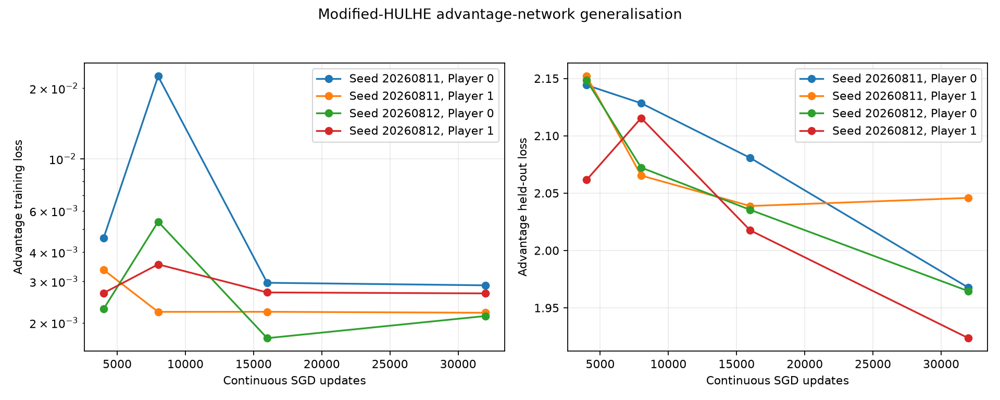
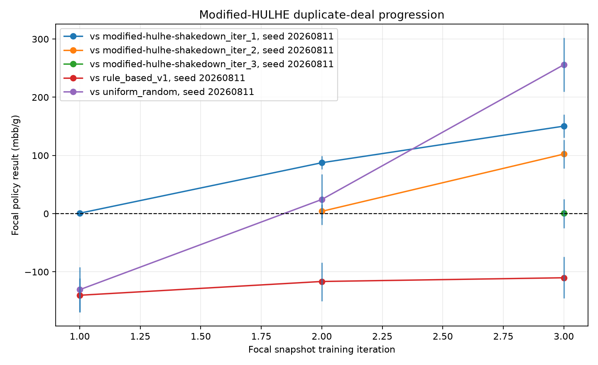

# Modified HULHE

This directory records calibration and policy-evaluation evidence for the optimised modified-HULHE Deep CFR pipeline. It does not yet contain a final training result.

## Status

- **Advantage-update calibration:** COMPLETE
- **GPU batch calibration:** COMPLETE
- **Traversal-worker selection:** COMPLETE
- **Generalisation investigation:** COMPLETE
- **Policy-progression evaluator:** COMPLETE
- **Production shakedown and policy measurements:** COMPLETE
- **Production candidate:** FROZEN AT 140 ITERATIONS
- **Long cloud run:** NOT STARTED

## Selected candidate

| Setting | Selection | Evidence |
|---|---:|---|
| Traversals per player (`K`) | 10,000 | Representative collection workload |
| Advantage SGD steps | 32,000 | Held-out loss continued improving from 16,000 to 32,000 updates |
| Advantage batch size | 10,000 | 20,000 was materially slower |
| Learning rate | 0.001 | Finite and stable calibration |
| Gradient clip norm | 1.0 | Finite and stable calibration |
| Traversal workers | 12 | Highest measured traversal and complete-iteration throughput |
| Production iterations | 140 | Approximately 47–50 hours including sparse strategy snapshots |
| Strategy snapshots | Iterations 1, 2, every 5 through 135, and final 140 | Frequent monitoring without fitting a strategy network every iteration |

The selected strategy-network budget is 16,000 updates with batch size 10,000. `configs/deep_cfr/modified_hulhe_production.toml` freezes the 140-iteration candidate. Its strategy reservoir grows every iteration, but the playable average-strategy network is fitted only at listed milestones and automatically at final iteration 140.

## Advantage-network fit

One K=10,000 collection produced 30,000 retained advantage samples for Player 0. A fixed 27,000/3,000 train/validation split trained one freshly initialised network continuously through all four milestones.

| Updates | Training loss | Validation loss | Cumulative time |
|---:|---:|---:|---:|
| 4,000 | 0.004590 | 2.144159 | 65.12 s |
| 8,000 | 0.022484 | 2.128387 | 127.99 s |
| 16,000 | 0.002959 | 2.080709 | 253.46 s |
| 32,000 | 0.002886 | **1.967588** | 504.96 s |

Validation loss improved by 5.4% from 16,000 to 32,000 updates, selecting the declared maximum of 32,000. The large train/validation gap remains a production-monitoring concern; low training loss alone does not establish strategy quality.


## Generalisation investigation

The continuous 32,000-update fit was repeated for both players across two independently seeded collections. Each case retained 30,000 samples and used a fixed, disjoint 27,000/3,000 training/validation split. All samples came from iteration 1 and therefore had equal Linear CFR weight.

| Seed | Player | Best update | Training loss at 32k | Validation loss at 32k |
|---:|---:|---:|---:|---:|
| 20260811 | 0 | 32,000 | 0.002886 | 1.967588 |
| 20260811 | 1 | 16,000 | 0.002204 | 2.045822 |
| 20260812 | 0 | 32,000 | 0.002135 | 1.964542 |
| 20260812 | 1 | 32,000 | 0.002666 | 1.923552 |

The large training/validation gap is systematic rather than isolated to one player, reservoir or split. The 32,000-update milestone was best in three cases; Player 1 at seed 20260811 was marginally best at 16,000 and worsened by 0.35% at 32,000. The candidate therefore retains 32,000 updates. There is no evidence for changing the model or learning rate, while K remains 10,000 based on the completed policy-level progression results.



## GPU batch selection

Both batch sizes used identically initialised networks, the same frozen reservoir and split seed, 50 warm-up steps and 200 timed updates.

| Batch | Updates/s | Median GPU utilisation | Peak allocated VRAM | Peak reserved VRAM |
|---:|---:|---:|---:|---:|
| 10,000 | **63.91** | 52% | 256.0 MB | 421.5 MB |
| 20,000 | 39.18 | 58% | 472.6 MB | 639.6 MB |

Batch 20,000 was 38.7% slower despite slightly higher GPU utilisation, so the candidate retains batch 10,000.


## Traversal-worker selection

Three one-iteration runs changed only the worker count. Neural fitting was limited to 100 identical updates per phase because this check measures worker scaling, not strategy quality.

| Workers | Traversal time | Collection throughput | Complete iteration |
|---:|---:|---:|---:|
| 8 | 33.00 s | 605.97 traversals/s | 76.89 s |
| 10 | 31.67 s | 631.45 traversals/s | 41.15 s |
| 12 | **29.53 s** | **677.33 traversals/s** | **39.12 s** |

Twelve workers improved collection throughput by 7.3% and complete-iteration time by 4.9% relative to ten workers. The eight-worker run incurred a one-time neural warm-up cost, so its separated traversal measurement is more representative than its complete-iteration time.


## Hardware and boundaries

Calibration used Python 3.12.3, PyTorch 2.13.0, CUDA 13.0 and one NVIDIA A100-SXM4 with 80 GB VRAM. The container provided a 13.6-core CPU quota, approximately 250 GB decimal RAM and a configured 200 GB storage budget. `calibration.json` preserves the full environment and resolved configuration.

These calibration results selected a bounded production candidate. The completed shakedown below establishes early policy progression and operational recovery, but three iterations do not show that quality will improve monotonically or approach Nash equilibrium during the long run.

## Production shakedown

The production-scale shakedown completed three outer iterations with K=10,000, 32,000 advantage updates, batch 10,000, learning rate 0.001, gradient clipping at 1.0 and 12 traversal workers. All losses and parameters remained finite, legal-action validation remained active, checkpoints and snapshots were loadable, and memory and storage stayed within their configured limits.

Training used revision `b32a50b9539bf2fcca88c6148b38e4576cd18a2f`; rule-based evaluation used revision `cf1cc4aae3c0b800ee0efe7653fd5a1acaaba71b`. The curated run configuration and environment JSON files preserve the exact resolved settings and hardware record.

| Iteration | Total time | Traversal | Advantage training | Strategy training | Strategy samples |
|---:|---:|---:|---:|---:|---:|
| 1 | 22.88 min | 24.99 s | 17.83 min | 4.62 min | 272,860 |
| 2 | 23.41 min | 25.38 s | 18.17 min | 4.80 min | 569,624 |
| 3 | 24.03 min | 26.32 s | 18.90 min | 4.67 min | 873,306 |

The coordinator was deliberately stopped after iteration 2. It wrote a complete recovery checkpoint, resumed from `latest.pt`, restored the networks, reservoirs and random state, and completed iteration 3 with continuous metrics and no duplicate or missing iteration record.

Each formal match used 10,000 duplicate pairs, the same seed and swapped seats. Positive `mbb/g` favours the later or named focal snapshot.

| Match | mbb/g | 95% paired interval |
|---|---:|---:|
| Iteration 1 vs random | -130.60 | [-169.05, -91.90] |
| Iteration 2 vs random | 24.35 | [-19.25, 67.60] |
| Iteration 3 vs random | **255.85** | [209.70, 302.05] |
| Iteration 2 vs iteration 1 | **87.50** | [76.00, 98.85] |
| Iteration 3 vs iteration 1 | **150.35** | [130.50, 170.65] |
| Iteration 3 vs iteration 2 | **102.35** | [78.00, 127.10] |
| Iteration 1 vs `rule_based_v1` | -140.20 | [-169.75, -111.00] |
| Iteration 2 vs `rule_based_v1` | -116.55 | [-150.15, -83.70] |
| Iteration 3 vs `rule_based_v1` | -110.15 | [-145.55, -74.15] |

All three self-play intervals contained zero. The separately checked `rule_based_v1` policy beat uniform random by 96.65 mbb/g with a 95% paired interval of [63.40, 130.95], confirming that it is a meaningful stronger fixed baseline. The snapshots show decisive early progression against random and earlier snapshots, so K remains 10,000 and no model, learning-rate or regularisation change is indicated. Their continuing deficit against the rule-based policy is a production-monitoring target rather than evidence for changing K after only three iterations.



## Monitoring rules

Production training must stop on non-finite values, invalid actions or state, worker or checkpoint failure, or exhausted memory/storage. These conditions already raise from the solver, game, worker, preflight or checkpoint boundary; they are not converted into warnings.

Policy measurements are diagnostic rather than automatic stopping conditions. One or two disappointing H2H estimates must be recorded and investigated, not used to stop training. Only sustained stagnation or instability across several snapshots can justify one K=30,000 diagnostic. Any response changes one relevant configuration value while holding the others fixed; model size, learning rate and regularisation remain unchanged without corresponding evidence.

Each completed iteration records training and held-out losses, phase times, traversal throughput, reservoir growth, process memory, CUDA peak memory and remaining storage. Recovery checkpoints remain independent of the sparse average-strategy snapshot schedule.

## Progression evaluation

The evaluator compares validated average-strategy snapshots against uniform random, the frozen `rule_based_v1` baseline, fixed snapshot anchors, themselves for neutrality and selected earlier snapshots. Each physical deal is replayed with the agents swapped between seats while retaining the same seat-labelled private cards and public runout. The two focal-policy outcomes form one independent duplicate-pair score.

Results report `mbb/g` with seeded paired-bootstrap confidence intervals and are atomically upserted into a compact CSV used directly for plotting. The rule-based baseline uses only the acting player's visible cards and public betting state.

| Strength | Examples | Facing no bet | Facing a bet |
|---|---|---|---|
| Very weak | High card or board-only strength | Check | Fold |
| Weak made | Bottom/middle pair or pocket underpair | Check | Fold |
| Marginal/draw | Top pair, pocket overpair or private-card flush/straight draw | Check | Call |
| Strong | Two pair, trips, straight or flush | Bet | Call; raise on river |
| Very strong | Full house, quads or straight flush | Bet | Raise |

A made hand counts only when a hole card contributes to it. On the complete river, the exact best five-card hand, including kickers, must improve the board's five-card hand. Draws are ignored on the river. The agent is deterministic, does not adapt or bluff, and falls back to check/call when the fixed-limit betting cap prevents a raise.

These deliberately simple rules are frozen as `rule_based_v1`. They do not use pot odds, opponent modelling, hidden cards, Monte Carlo equity or learned-policy information. Results against this opponent measure performance against one understandable fixed policy, not exploitability.

The fixed shakedown protocol uses 10,000 duplicate pairs, seed 20260811, a 95% interval and 10,000 bootstrap resamples. Multiple snapshots evaluate each later policy against every selected earlier policy; `--anchor-snapshot PATH` can add a fixed policy from another run.

## Cloud shakedown commands

Run these commands from the checked-out repository at `/workspace/ac-cfr`. Preflight validates the resolved production workload without creating a run:

```bash
.venv/bin/python train.py \
  --config configs/deep_cfr/modified_hulhe_shakedown.toml \
  --run-id modified-hulhe-shakedown \
  --runs-root /workspace/ac-cfr/runs \
  --preflight
```

Start the shakedown in a detached persistent session:

```bash
tmux new-session -d -s hulhe-shakedown \
  "cd /workspace/ac-cfr && exec .venv/bin/python train.py \
  --config configs/deep_cfr/modified_hulhe_shakedown.toml \
  --run-id modified-hulhe-shakedown \
  --runs-root /workspace/ac-cfr/runs"

tmux attach-session -t hulhe-shakedown
```

For the interruption test, wait until at least one iteration has completed, then identify the coordinator process attached to the tmux pane:

```bash
tmux display-message -p -t hulhe-shakedown '#{pane_pid}'
ps -o pid,ppid,pgid,stat,etime,cmd -p <PID>
kill -TERM <PID>
```

Confirm from the `ps` output that `<PID>` is the training coordinator before signalling it. Sending `SIGTERM` only to that process avoids forwarding terminal `SIGINT` to traversal workers. The coordinator requests a stop at the end of the active outer iteration, writes its snapshot, checkpoint and metrics, then exits. Resume the immutable saved configuration after it has stopped:

```bash
tmux new-session -d -s hulhe-shakedown-resume \
  "cd /workspace/ac-cfr && exec .venv/bin/python train.py \
  --resume /workspace/ac-cfr/runs/modified-hulhe-shakedown/checkpoints/latest.pt"
```

After all three snapshots exist, run the seeded duplicate-deal progression evaluation and plot its results:

```bash
.venv/bin/python evaluate.py modified-hulhe \
  --snapshot runs/modified-hulhe-shakedown/strategy_snapshots/modified-hulhe-shakedown_iter_1.pt \
  --snapshot runs/modified-hulhe-shakedown/strategy_snapshots/modified-hulhe-shakedown_iter_2.pt \
  --snapshot runs/modified-hulhe-shakedown/strategy_snapshots/modified-hulhe-shakedown_iter_3.pt \
  --include-random \
  --include-rule-based \
  --include-self-play \
  --duplicate-pairs 10000 \
  --seed 20260811 \
  --confidence-level 0.95 \
  --bootstrap-resamples 10000 \
  --results runs/modified-hulhe-shakedown/evaluation/h2h.csv

.venv/bin/python plot_results.py modified-hulhe-h2h \
  runs/modified-hulhe-shakedown/evaluation/h2h.csv \
  --output runs/modified-hulhe-shakedown/evaluation/h2h.png
```

## Production monitoring

All generated production snapshots are retained. The 140-iteration configuration produces snapshots at iterations 1, 2, every 5 through 135, and automatically at iteration 140, for 30 playable snapshot files. Snapshot files are not subject to checkpoint retention; only recovery checkpoints rotate down to the newest two.

The unattended watcher evaluates representative iterations 1, 2, 5, 10, 20, 40, 60, 80, 100, 120 and 140. Each policy plays the fixed random and `rule_based_v1` baselines and, after the first milestone, the preceding representative snapshot. It uses 10,000 duplicate pairs, seed 20260811, swapped seats and a 95% paired-bootstrap interval. Completed protocol rows are detected from their full composite key and are not recomputed after a watcher restart. A missing plot is rebuilt from the CSV.

The watcher never stops training or selects a policy. The final snapshot is selected by default. A possible deterioration investigation requires two consecutive representative snapshots whose direct results against their respective preceding representative snapshots both have confidence-interval upper bounds below zero. Nearby saved snapshots are then evaluated against the same strongest earlier candidate. An earlier policy can replace the final policy only if two consecutive late snapshots, including the final snapshot, both lose directly to that same candidate with their complete 95% intervals below zero; random and rule-based results are retained as secondary fixed-baseline evidence. Isolated declines and overlapping intervals do not trigger selection or stopping.

Start training first. After its run directory appears, start the watcher in a second detached session:

```bash
tmux new-session -d -s hulhe-production-monitor \
  "cd /workspace/ac-cfr && exec .venv/bin/python -u evaluate.py modified-hulhe-watch \
  --config configs/deep_cfr/modified_hulhe_production_monitoring.toml \
  --run-directory /workspace/ac-cfr/runs/modified-hulhe-production"
```

The watcher waits for atomically completed snapshots, delays 60 seconds so the next traversal phase can finish, and limits PyTorch to one CPU thread before evaluating. Its default outputs are `runs/modified-hulhe-production/evaluation/production_h2h.csv` and `production_h2h.png`. If the watcher is interrupted, rerun the same command; existing complete comparisons are skipped.

## Persistence and backup decision

`/workspace` is mounted from the RunPod network volume `mfs#us-md-1.runpod.net:9421[/networkvolumes/yle5htrab2]`, rather than the container's local filesystem. This supports stopping the pod while retaining the run, provided that the network volume itself is kept.

External backup is explicitly waived for this production run. The RunPod network volume is the sole storage copy, so deleting or losing that volume would lose the checkpoints and results. Before launch, confirm in the RunPod console that the volume persists after pod termination, is not scheduled for automatic deletion and has at least 60 GB available. Do not delete it until the completed run artifacts have been downloaded elsewhere.

The application-level checkpoint budget remains 200 GB. Mature settled usage is expected to be about 27 GB, while an atomic checkpoint replacement can temporarily require roughly 39–43 GB because the newest two checkpoints remain intact until the replacement completes. All 30 strategy snapshots together are expected to use only about 0.2 GB.

A restore requires the same committed source revision and the complete run directory containing `run_config.json`, metrics, snapshots and at least one recovery checkpoint. Restore into `/workspace/ac-cfr/runs/modified-hulhe-production`, verify `checkpoints/latest.pt` resolves to a retained checkpoint, and resume with:

```bash
.venv/bin/python train.py \
  --resume /workspace/ac-cfr/runs/modified-hulhe-production/checkpoints/latest.pt
```

Before final approval, record the RunPod volume-persistence check and this accepted single-copy risk. After the run, download the final checkpoint, all strategy snapshots, configuration, metrics, evaluations and logs before deleting the volume.

## Files

- `calibration.json`: source revision, environment, resolved configuration and calibration method.
- `network_fit.csv`: original continuous-fit milestones.
- `generalisation_fit.csv` and `generalisation_fit.json`: seed/player fit curves, split and reservoir provenance, and resulting decision.
- `batch_throughput.csv`: warmed GPU batch measurements.
- `worker_scaling.csv` and `worker_scaling.json`: controlled worker comparison and selection.
- `shakedown_iteration_metrics.csv`: production-scale phase timings, losses, reservoirs and resource measurements.
- `shakedown_h2h.csv`: seeded random, rule-based, self-play and snapshot-progression results.
- `shakedown_run_config.json`: resolved shakedown configuration and training source revision.
- `shakedown_environment.json`: shakedown hardware and software environment.
- `plots/`: visual summaries generated from the CSV files.

Raw checkpoints, snapshots, logs and run-local metrics remain under ignored `runs/` directories.
