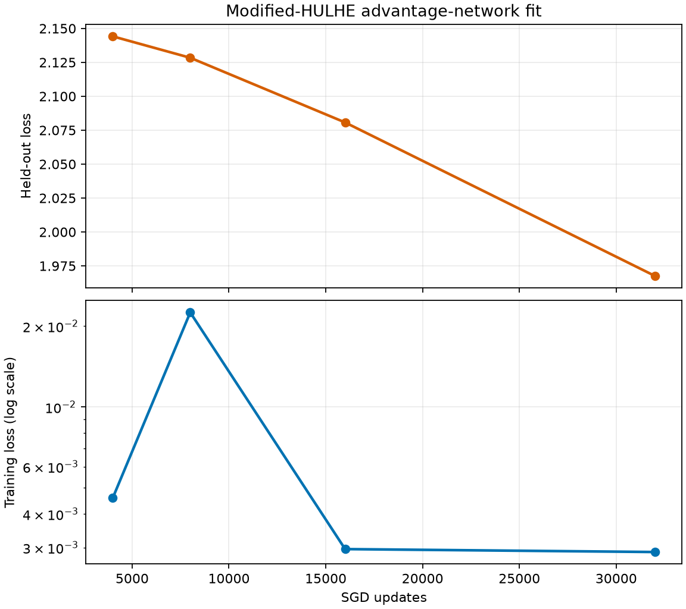
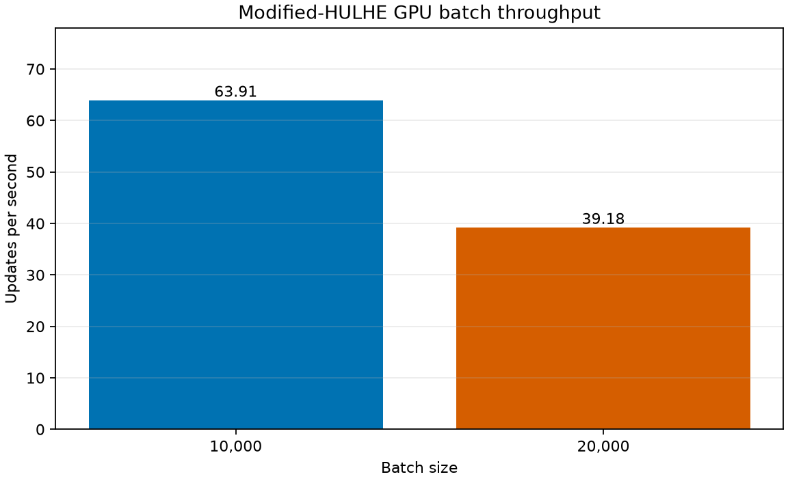
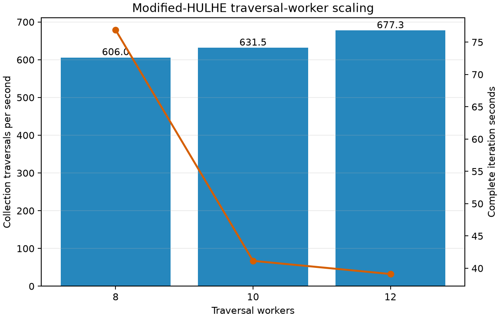

# Modified HULHE Cloud Calibration

This directory records the accepted hardware calibration and traversal-worker selection evidence for the optimised modified-HULHE Deep CFR pipeline. It does not contain a final strategy-training result.

- **Advantage-update calibration:** COMPLETE
- **GPU batch calibration:** COMPLETE
- **Traversal-worker selection:** COMPLETE
- **Production shakedown:** PENDING
- **Policy-progression evaluation:** PENDING
- **Long cloud run:** NOT STARTED

## Selected candidate

| Setting | Selection | Evidence |
|---|---:|---|
| Traversals per player (`K`) | 10,000 | Representative collection workload |
| Advantage SGD steps | 32,000 | Held-out loss continued improving from 16,000 to 32,000 updates |
| Advantage batch size | 10,000 | 20,000 was materially slower |
| Learning rate | 0.001 | Finite and stable calibration |
| Gradient clip norm | 1.0 | Finite and stable calibration |
| Traversal workers | 12 | Highest measured traversal and complete-iteration throughput |

The strategy-network budget remains provisionally 16,000 updates with batch size 10,000. The candidate is not frozen until the production shakedown, recovery test and policy-progression safeguards pass.

## Advantage-network fit

One K=10,000 collection produced 30,000 retained advantage samples for Player 0. A fixed 27,000/3,000 train/validation split trained one freshly initialised network continuously through all four milestones.

| Updates | Training loss | Validation loss | Cumulative time |
|---:|---:|---:|---:|
| 4,000 | 0.004590 | 2.144159 | 65.12 s |
| 8,000 | 0.022484 | 2.128387 | 127.99 s |
| 16,000 | 0.002959 | 2.080709 | 253.46 s |
| 32,000 | 0.002886 | **1.967588** | 504.96 s |

Validation loss improved by 5.4% from 16,000 to 32,000 updates, selecting the maximum declared 32,000-update budget. The large train/validation gap remains a shakedown diagnostic concern; low fitting loss alone is not evidence of strategy quality.

## GPU batch selection

Both batch sizes used identically initialised networks, the same frozen reservoir and split seed, 50 warm-up steps and 200 timed updates.

| Batch | Updates/s | Median GPU utilisation | Peak allocated VRAM | Peak reserved VRAM |
|---:|---:|---:|---:|---:|
| 10,000 | **63.91** | 52% | 256.0 MB | 421.5 MB |
| 20,000 | 39.18 | 58% | 472.6 MB | 639.6 MB |

Batch 20,000 was 38.7% slower despite slightly higher GPU utilisation, so the candidate retains batch 10,000.

## Traversal-worker selection

Three one-iteration runs kept K=10,000, model, seed, CUDA placement, inference batching, reservoirs and learning settings fixed while changing only the worker count. Neural fitting was bounded to 100 identical updates per phase because this check measures worker scaling rather than strategy quality.

| Workers | Traversal time | Collection throughput | Complete iteration |
|---:|---:|---:|---:|
| 8 | 33.00 s | 605.97 traversals/s | 76.89 s |
| 10 | 31.67 s | 631.45 traversals/s | 41.15 s |
| 12 | **29.53 s** | **677.33 traversals/s** | **39.12 s** |

Twelve workers improved collection throughput by 7.3% and complete-iteration time by 4.9% relative to ten workers. The eight-worker run incurred a one-time neural warm-up cost, so its separated traversal measurement is more representative than its complete-iteration time.

## Hardware and boundaries

Calibration used Python 3.12.3, PyTorch 2.13.0, CUDA 13.0 and one NVIDIA A100-SXM4 with 80 GB VRAM. The container exposed a 13.6-core CPU quota, approximately 250 GB decimal RAM and a configured 200 GB storage budget. Full environment and resolved configuration data are preserved in `calibration.json`.

These results select a bounded production candidate; they do not show that modified-HULHE policy quality improves monotonically or approaches Nash equilibrium. The production shakedown and modified-HULHE duplicate-deal progression evaluation remain mandatory before the long run.

## Files

- `calibration.json` records the source revision, environment, resolved configuration, collection measurements and calibration method.
- `network_fit.csv` contains the full-precision continuous-fit milestones.
- `batch_throughput.csv` contains the full-precision warmed GPU batch measurements.
- `worker_scaling.json` records the controlled comparison method and selection.
- `worker_scaling.csv` contains the full-precision worker measurements.
- `plots/` contains compact visual summaries generated from the corresponding CSV files.

Raw checkpoints, snapshots, logs and run-local metrics remain under ignored `runs/` directories.
